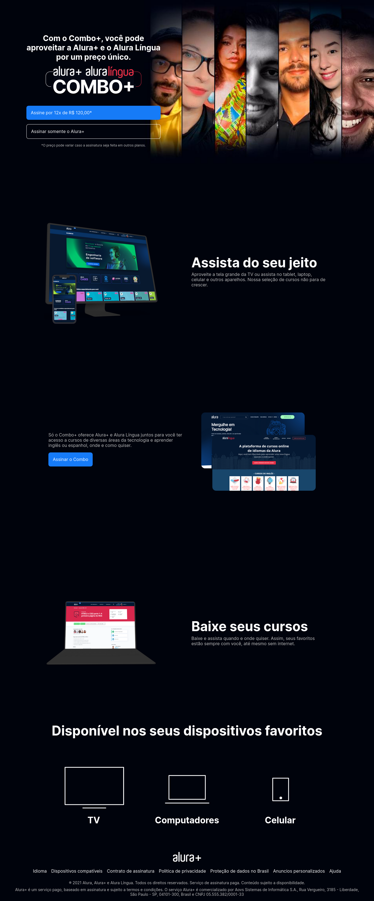

<h1 align="center">Projeto 2: AluraPlux</h1>

## :memo: Sobre o Projeto
Projeto do Curso de HTML/CSS da Alura, sendo esse a parte 5/6 da formação <strong>A partir do zero: HTML e CSS para projetos web</strong>

O projeto foi realizado apos o [Projeto 1: Meu Portfolio](https://github.com/drpedronakata/Projeto1_Meu-Portfolio_HTML-CSS).

## :wrench: Ferramentas utilizadas:
* HTML

* CSS

## :notebook_with_decorative_cover: Certificados
* HTML e CSS: praticando HTML/CSS

## :bust_in_silhouette: Criador
<table>
  <tr>
    <td align="center">
      <a href="https://github.com/drpedronakata">
         
        
          <b>drpedronakata</b>
        
      </a>
    </td>
  </tr>
</table>

## :books: Links dos materiais

* [Curso HTML/CSS da Alura](https://cursos.alura.com.br/course/html-css-praticando-html-css)

* [Github do Curso](https://github.com/alura-cursos/aluraplus)

* [Figma do Projeto](https://www.figma.com/file/tFDVyNuKhrT2G03k2dCstW/Alura-Plus---Layout?node-id=1-77&t=DXa1ap0ubR93B8OZ-0)

* [Readme Template](https://github.com/tatialveso/readme-template/blob/main/README.md)

* [Lista de Emojis para Github markdown](https://gist.github.com/rxaviers/7360908)
